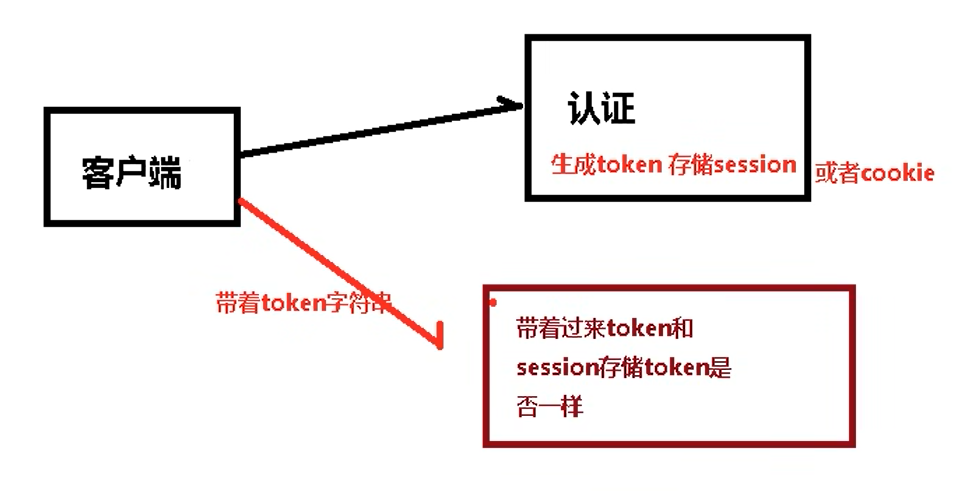

# “认证”  “授权”
# spring security 本质是一个过滤器链（多个过滤器）

## 1.FilterSecurityIntercepter  方法级的过滤器
## 2.ExceptionTranslationFilter
## 3.UsernamePasswordAuthenticationFilter

# spring boot自动配置spring security

## 1.配置过滤器 DelegatingFilterProxy
## 2.UserDetailService 查询数据库的用户名和密码
### 2.1创建类实现UsernamePasswordAuthenticationFilter 重写三个方法
### 2.2创建类实现UserDetailsService，写查询数据过程，返回User对象。 User是spring security提供的对象
## 3.PasswordEncoder 对密码进行加密（数据加密）

# "认证" 三种方式
## 1. application.properties
      '''
         #spring.security.user.name=admin
         #spring.security.user.password=admin
      '''
## 2. SecurityConfig.class
## 3. UserSecurityConfig 配置类中设置使用那个UserDetailsService
## 4. 自定义登录页面
###  4.1 UserSecurityConfig 里面定义 protected void configure(HttpSecurity http)
###  4.2 login.html

# "基于角色和权限进行访问控制"
## 1. hasAuthority 是否有指定的权限
   ### 1.1 配置类中设置那些权限才可以访问某个路径  antMatchers("/demo/index").hasAuthority("admin")
   ### 1.2 UserDetailsService 设置权限  AuthorityUtils.commaSeparatedStringToAuthorityList("admin");
## 2. hasAnyAuthority 具有多个权限
   ### .antMatchers("/demo/index").hasAnyAuthority("admin","manager")
## 3. hasRole 用户具有某权限就可访问，否则403
   ### .antMatchers("/demo/index").hasRole("admin")
## 4. hasAnyRole  同上，省略

# 定制403页面 
    '''
        '''http.exceptionHandling().accessDeniedPage("/unauthn.html");
    '''

# “常用注解”
@EnableGlobalMethodSecurity

## 1. @Secured 用户具有某个橘色，可以访问某个方法
### 1.1 开启  
      ''' 
         @EnableGlobalMethodSecurity(securedEnabled = true)
         public class SpringSecurityDemoApplication {
      '''
### 1.2 控制类 “”“@GetMapping("/admin")
      '''
      @Secured({"ROLE_admin","ROLE_manager"})
      public String admin() {
      return "hello my role is correct!!!";
      }
      '''
### 1.3 AuthorityUtils.commaSeparatedStringToAuthorityList("admin,ROLE_admin");

## 2. @PreAuthorize   在进入方法前对权限进行认证
###   2.1 开启  同上
###   2.2 控制类 
      '''
      @PreAuthorize("hasAnyAuthority('admin')")
      public String admin() {
      return "hello my role is correct!!!";
      }
      '''
## 3. @PostAuthorize  在方法执行后对权限进行认证。一般用于对返回值进行判断
   ### 3.1 开启 @EnableGlobalMethodSecurity(securedEnabled = true,prePostEnabled = true)
   ### 3.2 控制类 故意出错 admins
      '''
         @PostAuthorize("hasAnyAuthority('admins')")
         public String admin() {
         System.out.println("access /demo/admin method already!!!!");
         return "hello my role is correct!!!";
         }
      '''
## 4. @PreFilter  对传入数据进行过滤
## 5. @PostFilter 对返回数据进行过滤

# 用户退出
## 1. 配置类
      '''
         http.logout().logoutUrl("/logout").logoutSuccessUrl("/demo/hello").permitAll();
      '''
##  2. success.html
##  3. 修改登录配置类
      '''
        .defaultSuccessUrl("/success.html")//登录成功后跳转路径
       '''
# CSRF 跨站恶意攻击 跨站请求伪造
当前浏览器打开京东和淘宝。是否可以得到cookie信息？
PATCH,PUT,POST,DELETE方法进行保护。
默认开启保护
## 1.开启csrf
    '''
        .and().csrf().disable();//close csrf防护
    '''
## 2.原理

## 3.源码
    CsrfFile
## 4.Sample 
### 4.1 pom.xml
    '''
        <dependency>
            <groupId>org.thymeleaf.extras</groupId>
            <artifactId>thymeleaf-extras-springsecurity5</artifactId>
        </dependency>
    '''
    内容太多，具体参考https://www.bilibili.com/video/BV15a411A7kP?p=19&vd_source=efa677340522dfa2cf46f63cb95dbc70

